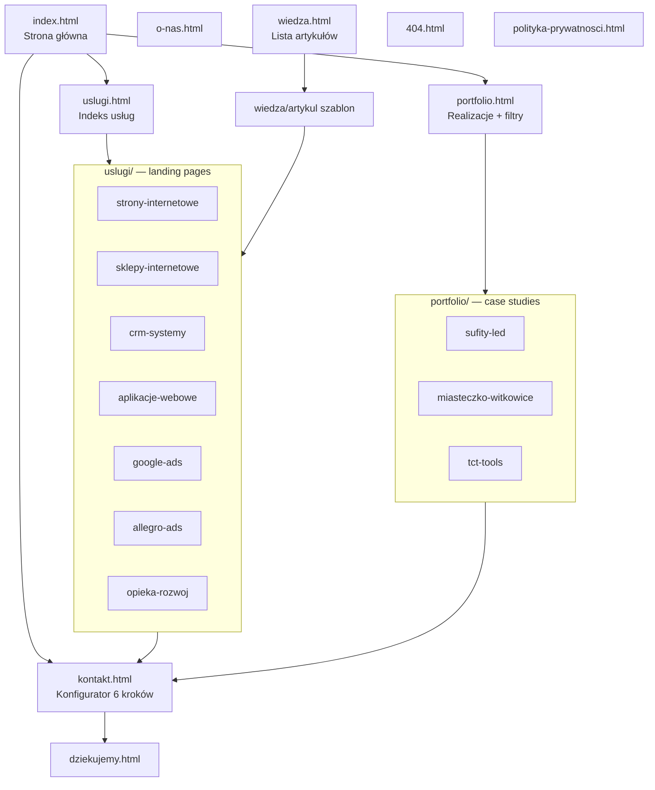
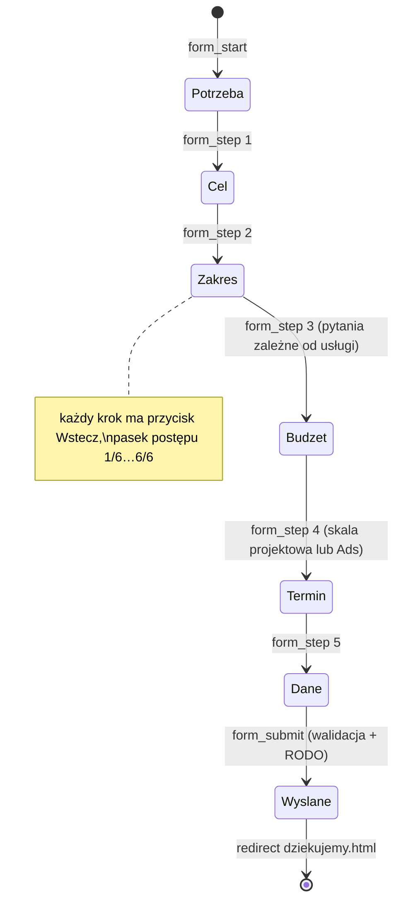

# Architektura — Code & Pixel
**Aktualizacja:** 2026-07-13 (redesign wg briefu klienta — patrz `../brief.md`)

## Mapa serwisu

## Flow konfiguratora (kontakt.html)

## Component reuse

| Komponent | index | uslugi | landing ×7 | realizacje | case ×3 | o-nas | wiedza | artykuł | kontakt | systemowe |
|---|---|---|---|---|---|---|---|---|---|---|
| Header + mega menu | ✓ | ✓ | ✓ | ✓ | ✓ | ✓ | ✓ | ✓ | ✓ | ✓ |
| Footer 4-kolumnowy | ✓ | ✓ | ✓ | ✓ | ✓ | ✓ | ✓ | ✓ | ✓ | ✓ |
| Sticky CTA mobile | ✓ | ✓ | ✓ | ✓ | ✓ | ✓ | ✓ | ✓ | — | — |
| Breadcrumbs | — | ✓ | ✓ | ✓ | ✓ | ✓ | ✓ | ✓ | ✓ | — |
| `.service-card` (7 usług) | ✓ | ✓ | powiązane | — | — | — | — | — | — | 404 |
| `.portfolio-card` | ✓ | — | ✓ (filtr kategorii) | ✓ | prev/next | — | — | — | — | — |
| `.kpi-card` (liczby) | ✓ | — | ✓ | — | ✓ | ✓ | — | — | — | — |
| `.process` (linia kursu) | ✓ | — | ✓ (wariant usługi) | — | ✓ | ✓ | — | — | — | — |
| `.faq` accordion | — | ✓ | ✓ | — | — | — | — | — | ✓ | — |
| `.case-quote` (opinie) | ✓ | — | ✓ | — | ✓ | — | — | — | — | — |
| `.cta-strip` | ✓ | ✓ | ✓ | ✓ | ✓ | ✓ | ✓ | ✓ | — | ✓ |
| Karta artykułu | — | — | powiązane | — | — | — | ✓ | ✓ | — | — |

## Poziomy głębi (system tła)

1. **Powierzchnia** (`--depth-surface`, Off White #F5F3EE) — hero podstron treściowych, sekcje tekstowe
2. **Strefa przejściowa** (`--depth-mid`, Ocean Navy #0E2236) — karty, sekcje usług
3. **Głębiny** (`--depth-deep`, Deep Navy #071525) — footer, case studies, CTA końcowe, sekcje premium

Strona główna: narracja zanurzenia — jasna powierzchnia w hero → stopniowe
ciemnienie przy scrollu → CTA końcowe jako „światło kursu".

## Zdarzenia analityczne (js/main.js → dataLayer)

`cta_click` (lokalizacja, tekst, podstrona) · `form_start` (typ, usługa) ·
`form_step` (numer, odpowiedź) · `form_submit` (usługa, sukces/błąd) ·
`case_study_open` (projekt, kategoria) · `service_open` (usługa, źródło) ·
`contact_click` (telefon/e-mail/kalendarz)
